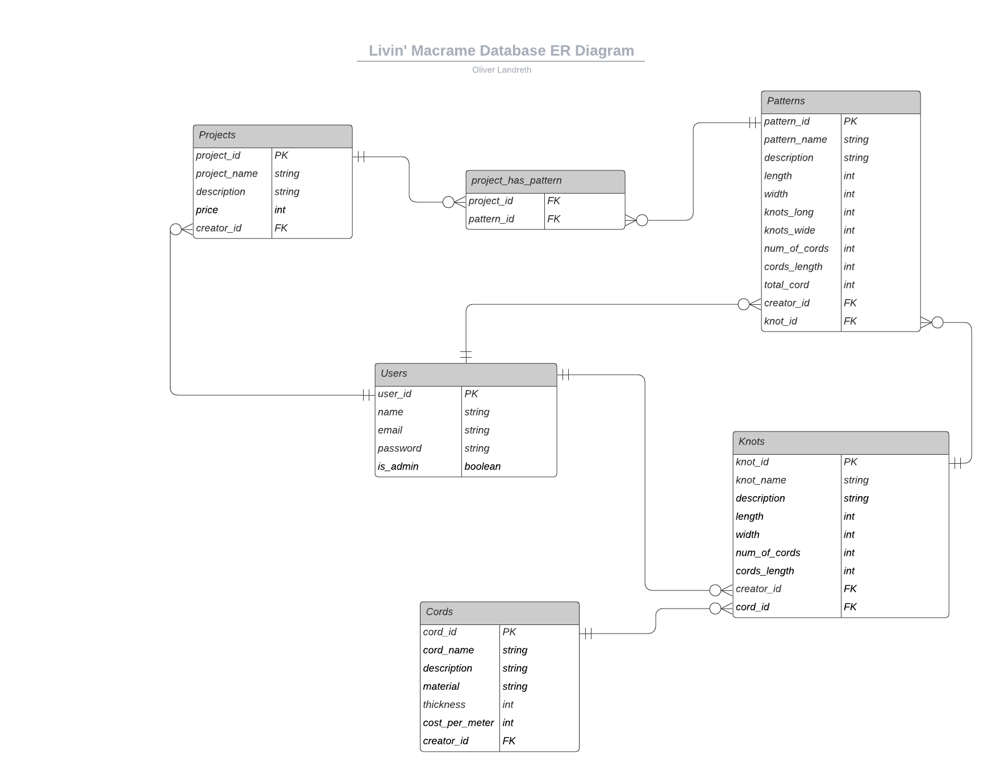
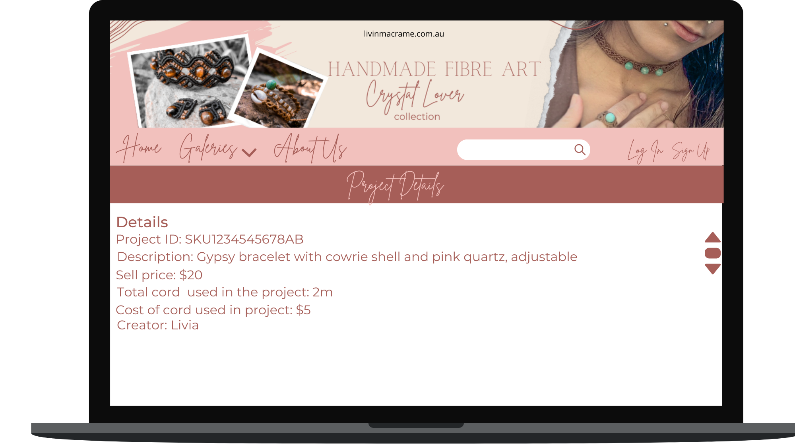
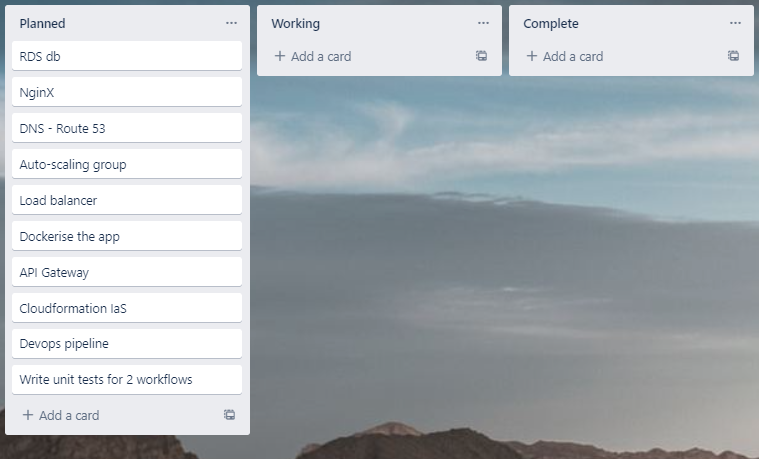
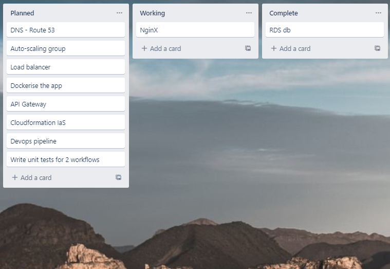
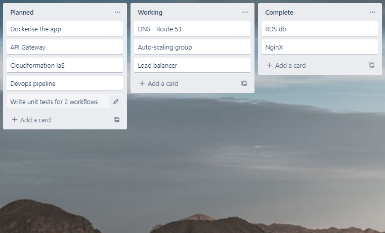
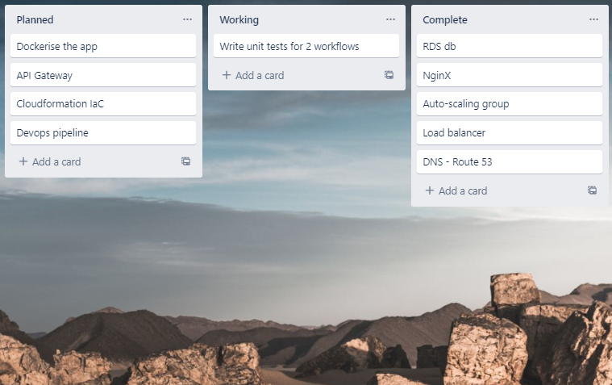
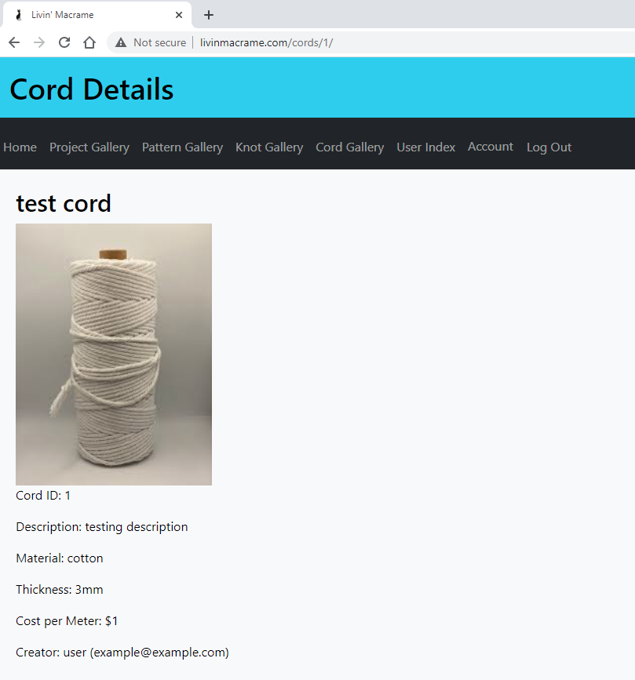
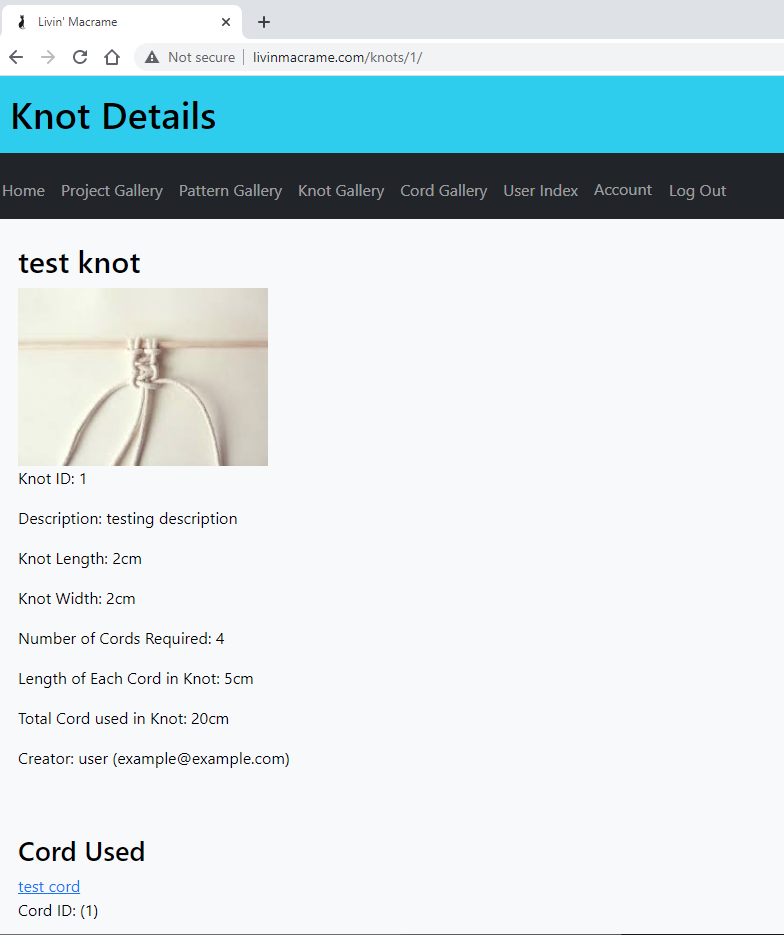
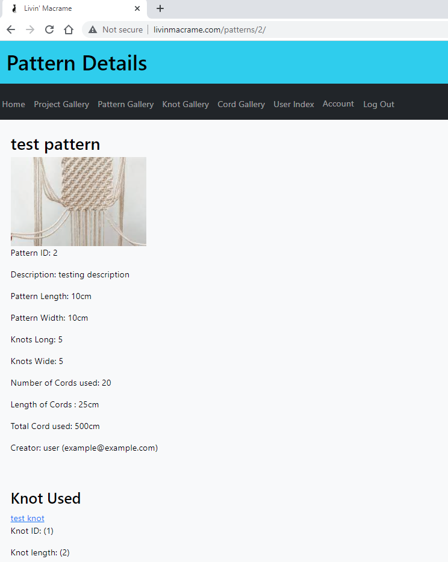
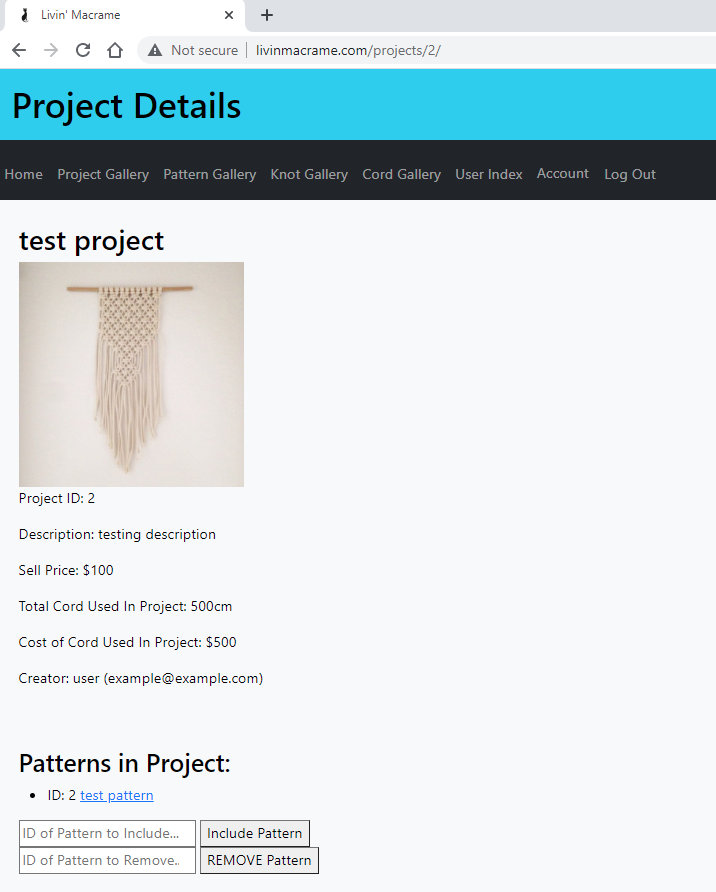

# Livin’ Macrame

http://www.livinmacrame.com/

Code repo:

https://github.com/Oli-Land/Livin_Macrame_Deployment


## T4_A2

## R1	Description of your website, including:


  ### - Purpose:

The Livin’ Macrame web app serves as a gallery of macrame projects and their components, and also a tool for calculating useful information relating to the creation and marketing of new macrame projects.


### - Functionality / features:

Users can browse galleries of existing projects and components, create and upload their own with accompanying images, and most importantly use the in-built functions to plan and calculate many attributes of new projects. 

### Pages:

Home
- Introduction

Projects gallery
- Create new project
    - Enter project information using forms
- List of projects and their images

Project details
- Display calculated information about the project
- Choose patterns - the components of a project
- Upload image

Patterns gallery
- Create new pattern
    - Enter pattern information using forms
- List of patterns and their images

Pattern details
- Display calculated information about the pattern
    - Choose knot - a component of a pattern
- Upload image

Knots gallery
- Create new knot
    - Enter knot information using forms

Knot details
- Display calculated information about the knot
    - Choose cord - a component of a knot
- Upload image

Cords gallery
- Create new cord
- Enter cord information using forms

Cord details
- Display information about the cord
- Upload image

User Index
- List signed up users and their email addresses

Account
- Display and update account information
- Display information about the user’s created projects

Log in
- Login form. Only visible when logged out

Sign up
- Sign up form. Only visible when logged out


### Future planned features:

- Shop / payments
- Tutorials - embedded youtube
- Graphical interface to design pieces (like draw.io but with images of macrame patterns)
- Aesthetic interface
- Advertising
    


### - Target audience:

The application is intended to provide a tool for macrame artists to assist in the creation of macrame projects. 

Another target audience is the customer who wishes to order an item from the gallery or commission a piece customised with their specific desired qualities.


### - Tech stack:

- AWS:
  - Route 53
  - API Gateway
  - Load Balancer
  - EC2
  - Aurora
  - S3 Bucket
- Docker
- NGINX
- Flask:
  - alembic==1.7.5
  - boto3==1.20.9
  - botocore==1.23.9
  - click==8.0.3
  - Faker==9.8.0
  - Flask==2.0.2
  - Flask-Login==0.5.0
  - flask-marshmallow==0.14.0
  - Flask-Migrate==3.1.0
  - Flask-SQLAlchemy==2.5.1
  - greenlet==1.1.2
  - importlib-metadata==4.8.2
  - importlib-resources==5.4.0
  - itsdangerous==2.0.1
  - Jinja2==3.0.2
  - jmespath==0.10.0
  - Mako==1.1.6
  - MarkupSafe==2.0.1
  - marshmallow==3.14.0
  - marshmallow-sqlalchemy==0.26.1
  - psycopg2-binary==2.9.1
  - python-dateutil==2.8.2
  - python-dotenv==0.19.1
  - s3transfer==0.5.0
  - six==1.16.0
  - SQLAlchemy==1.4.26
  - text-unidecode==1.3
  - urllib3==1.26.7
  - Werkzeug==2.0.2
  - zipp==3.6.0


## R2	Data Flow Diagram

The diagram depicts the steps involved with two example data flows:

- A registered user logging in to the website.
- A user navigating to the page of a specific project’s details.
  
The flow is the same for projects, patterns, knots and cords.


## R3	Application Architecture Diagram


- Amazon Route 53
  - User DNS requests are resolved by AWS Route 53.
- Amazon API Gateway
  -Acts as the application’s front door to the internet. Handles accepting and processing many concurrent API calls.
- Load Balancer
  -Automatically distributes incoming traffic across multiple EC2 instances. Monitors the health of its targets, and routes traffic only to the healthy targets. 
- EC2
  - Elastic Compute Cloud virtual machines contain and run the application logic
  - Auto-scales out or in when application traffic increases or decreases.
- Flask
  - Python based web server microframework. Inherently lightweight, it supports the modules for each application backend functionality.
  - Serves some static files for the application including HTML pages.
- Docker
- Container service. The Flask application code is packaged inside a docker container along with the OS and other required dependencies. 
  - The application containers are stored on AWS ECR.
- NGINX
  - Production web server.
  - Installed onto the EC2 outside the application container.
- Amazon Aurora
  - Cloud-based auto-scaling PostgreSQL relational database. Used to store application’s users and other persistent data, not including images.
- S3 Bucket
  - Images are stored on Amazon’s Simple Storage Service
  - Users access the bucket contents directly using a temporary pre-signed URL provided by the application and the boto3 module.


## Entity Relationship Diagram:

PostgreSQL relational database architecture:
 - Users may relate Cords to Knots, Knots to Patterns, and Patterns to Projects.




## R4	User Stories


- As a macrame artist, I want to have a tool for helping me calculate how much cord to use for a project so I can save time and materials.

- As a macrame artist, I want to view materials, patterns, projects, and tutorials so I can find inspiration to make my own projects.

- As a macrame artist I want somewhere online to store and retrieve information about the projects I create.

- As the owner of the app, I don’t want to have to learn complicated technology to scale the app as traffic increases, so I can focus on my business.

- As a small business owner, I want to have a functional app which won’t cost me a lot unless it is being used a lot, so I can avoid unnecessary costs. 

- As a customer I want to be able to browse macrame pieces so I can choose what to buy. 

- As a customer I want to be able to customise my ordered piece through the interface, so I can easily visualise before buying, and end up with a unique piece which suits me.

- As the owner of the website, I want to have a resource which could become popular, so I might generate income from advertising.


## R5	Wireframes for multiple standard screen sizes, created using industry standard software


Agile: Show revision - say you talked to team or customer or someone with a draft
Show how each user story fits into the wireframes


### Wireframe Design Revision
Aesthetics example for Project page:
 - Customer feedback-based design





## R6	Screenshots of your Trello board throughout the duration of the project

### Part A


### Part B










# Production testing:
 - live site testing at livinmacrame.com:









# Instructions to run locally

## Flask stack:

The app runs on `Flask`, using a `PostgreSQL` database via `Psycopg2` and `SQLAlchemy`. Serialization is courtesy of `Marshmallow`, templating from `Jinja2`, migrations from `Flask-Migrate` with `Alembic`, and sessions via `Flask-Login`.

Image upload and storage is handled with `boto3`, accessing an S3 bucket.


## Dependencies:
* Python 3
* PostgreSQL
* virtualenv
* pip

## Setup:

Instructions for Ubuntu 20:

### Update repositories:

```sudo apt-get update```

### Clone GitHub repository: 

```git clone https://github.com/Oli-Land/Livin_Macrame.git ```

### Install python virtual environment: 

```sudo apt-get install python3-venv```

### Install pip: 

```python -m pip install --upgrade pip```

### Install PostgreSQL:

```sudo apt-get install postgresql```

### CREATE VENV:
```bash
# /Livin_Macrame/
python3 -m venv venv
```

### ACTIVATE VENV
```bash
# /Livin_Macrame/
source venv/bin/activate
```

### INSTALL DEPENDENCIES
```bash
# /Livin_Macrame/
pip install -r requirements.txt
```

### CREATE DATABASE AND USER
```SQL
psql postgres

>> CREATE DATABASE <db_name_here>;
>> CREATE USER <user_name_here> WITH PASSWORD '<password_here>';
>> GRANT ALL PRIVILEGES ON DATABASE <db_name_here> TO <user_name_here>;
>> \q
```

### CREATE S3 BUCKET WITH IAM POLICY
The user needs to have programmatic access to the bucket to perform `GetObject`, `PutObject` and `DeleteObject` actions.

### SET ENVIRONMENT VARIABLES. 
Add a `.env` file to the folder `/Livin_Macrame/`:
```bash
DB_USER = # value from above
DB_PASS = # value from above
DB_NAME = # value from above
DB_DOMAIN = "localhost:5432"
SECRET_KEY = # dealer's choice - a long random string is most secure
AWS_ACCESS_KEY_ID= # value from AWS
AWS_SECRET_ACCESS_KEY=# value from AWS
AWS_S3_BUCKET=# value from AWS
```

### RUN APP 
```bash
# /Livin_Macrame/FlaskApp/
flask db-custom create
flask run
``` 

### TERMINAL COMMANDS

Terminal commands for the app must be executed from the `/Livin_Macrame/FlaskApp/` directory. Currently available commands are:

`flask db-custom drop` -> drops all tables

`flask db-custom create` -> creates all tables

`flask db-custom seed` -> seeds the projects table

`flask db-custom dump` -> dumps all tables from the database into a text file called db_dump.txt (Ensure the postgres role which created the database has superuser privileges)


